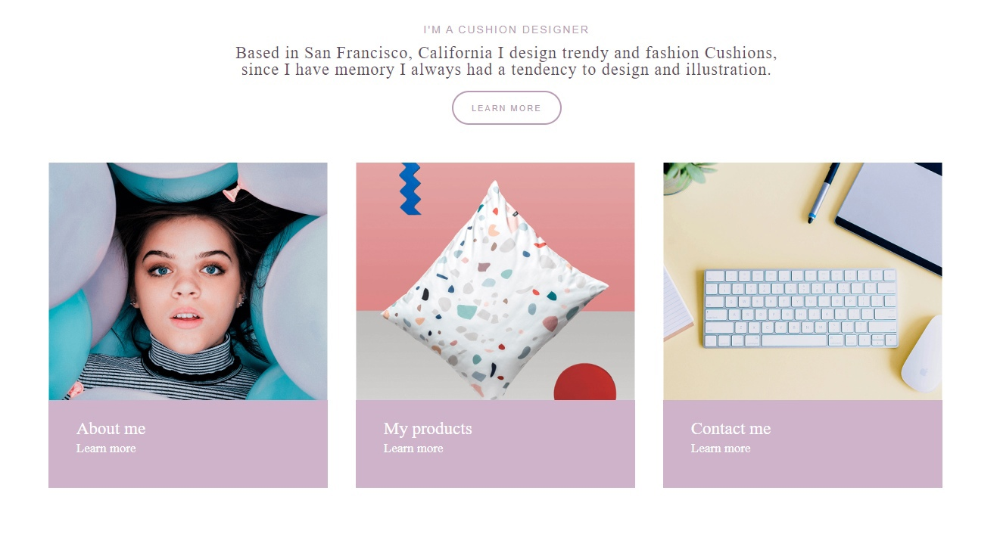

## 1 BEM(human-body)
```
<body>
    <main>
        <div class="human-body">
            <div class="human-body__head head">
                <div class="head__eyes"></div>
                <div class="head__nose"></div>
                <div class="head__mouth">
                    <div class="head__mouth_red"></div>
                </div>
            </div>
            <div class="human-body__torso torso">
                <div class="torso__stomach"></div>
                <div class="torso__left-arm">
                    <div class="torso__left-arm_scar"></div>
                </div>
                <div class="torso__right-arm"></div>
            </div>
            <div class="human-body__legs legs">
                <div class="legs__left-leg"></div>
                <div class="legs__right-leg"></div>
                <div class="legs__feet">
                    <div class="legs__feet-length">
                </div>
            </div>
        </div>
    </main>
</body>
```
## 2BEM

### 2BEM(header,form, card)
```
<header class="header">
    <div class="header__wrapper">
        <a href="" class="header__logo logo"></a>
        <nav class="header__navigation navigation">
            <ul class="navigation__list">
                <li class="navigation__item"><a href="" class="navigation__link"></a></li>
                <li class="navigation__item"><a href="" class="navigation__link"></a></li>
                <li class="navigation__item"><a href="" class="navigation__link"></a></li>
                <li class="navigation__item"><a href="" class="navigation__link"></a></li>
                <li class="navigation__item"><a href="" class="navigation__link"></a></li>
                <li class="navigation__item"><a href="" class="navigation__link"></a></li>
                <li class="navigation__item"><a href="" class="navigation__link navigation__link--cart"></a></li>
            </ul>
        </nav>
    </div>
</header>

<section class="callback">
    <div class="callback__contacts-wrapper">
    </div>
    <div class="callback__form-wrapper">
        <h3 class="callback__title"></h3>
        <p class="callback__text"></p>
        <form action="" class="callback__form form">
            <input type="text" class="form__input">
            <input type="text" class="form__input"><input type="text" class="form__input">
            <input type="text" class="form__input">
            <textarea name="" id="" cols="30" rows="10" class="form__input form__input--textarea"></textarea>
            <button type="submit" class="form__button form__button--submit"></button>
        </form>
    </div>
</section>

<section class="card">
    <h2 class="card__title"></h2>
    <p class="card__text"></p>
    <a class="card__link card__link--inside" href=""></a>
    <ul class="card__list list">
        <li class="list__item">
            
            <h3 class="list__item_subtext"></h3>
            <a href="" class="list__item__link"></a>
        </li>
        <li class="list__item">
            
            <h3 class="list__item_subtext"></h3>
            <a href="" class="list__item__link"></a>
        </li>
        <li class="list__item">
            
            <h3 class="list__item_subtext"></h3>
            <a href="" class="list__item__link"></a>
        </li>
    </ul>
</section>
```

### 3-4BEM(Emmet)

 (header)


`header.header>.header__wrapper>a.header__logo.logo>img.logo__image^nav.header__navigation.navigation>ul.navigation__list>li.navigation__item*6>a.navigation__link^li.navigation__item>a.navigation__link.navigation__link--cart`

 (form)


`section.callback>.callback__contacts-wrapper+.callback__form-wrapper>h3.callback__title+p.callback__text+form.callback__form.form>input.form__input*4+textarea.form__input.form__input--textarea+button:submit.form__button.form__button--submit`

  (card)

 

`section.card>h2.card__title+p.card__text+a.card__link+ul.card__list.list>li.list__item*3>img.list__item_photo+h3.list__item_subtext+a.list__item_link`
